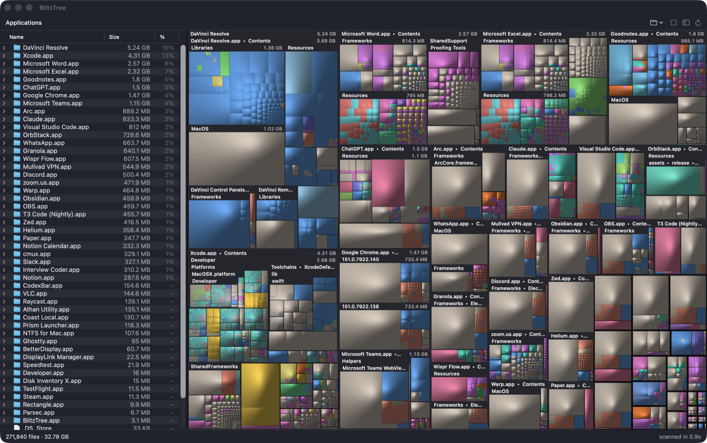

# BlitzTree

A fast, native disk-space treemap for macOS, in the spirit of WizTree. It scans a whole Mac (3.6M files) in about 14 seconds.



## Install

**[Download BlitzTree.dmg](https://github.com/ahmedkhaleel2004/blitztree/releases/latest/download/BlitzTree.dmg)** and drag the app into Applications. Requires Apple Silicon and macOS 14 or later.

The app is not notarized. On first launch, allow it in System Settings → Privacy & Security → **Open Anyway**, then grant Full Disk Access when prompted and relaunch.

## Features

- Cushion-shaded treemap colored by file type, with a synced Finder-style outline list
- Zoom into folders, reveal in Finder, or move to Trash (with confirmation)
- Live progress while scanning, and an optional free-space block
- Native AppKit/SwiftUI, with the Liquid Glass design on macOS 26 and later
- No network access, no telemetry

## Performance

| Home folder, 3.1M entries (M4) | Time |
|---|---|
| **BlitzTree** | **10.2 s** |
| Parallel `readdir` + `lstat` | 14.4 s |
| `du -skx` | 65.3 s |

- `getattrlistbulk(2)` reads a whole directory's metadata in one syscall instead of one `stat` per file.
- A Rust worker pool keeps many directories in flight, and scan threads run at user-interactive QoS so they stay on performance cores.

Method, full results and a comparison with other tools: [BENCHMARKS.md](BENCHMARKS.md).

## Accuracy

Sizes are allocated bytes, matching `du`. Hard-linked files count once, the scan stays on one volume, and cloud-only iCloud folders are never downloaded. Root-only system data that no app can read is reported in the status bar instead of hidden.

## Build from source

Requires Xcode 26 or later and Rust.

```sh
./build.sh              # build/BlitzTree.app
./deploy.sh             # build and install to /Applications
cargo test --release    # engine tests
```

The Rust engine hands the finished tree to the Swift UI as flat arrays over a C interface, with no copying. `BlitzTree <path>` scans a specific folder.

## License

MIT
