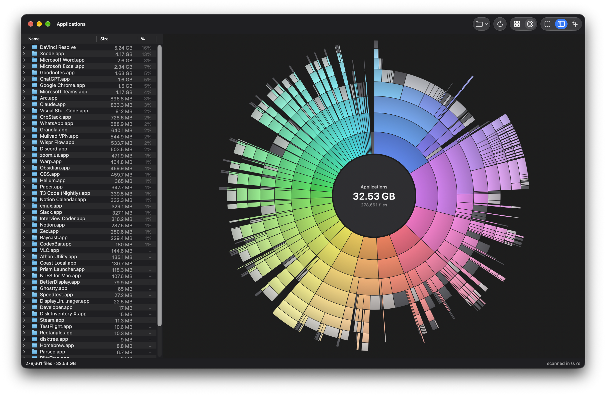

# BlitzTree

A fast, native disk-space treemap for macOS, in the spirit of WizTree. It scans a whole Mac (3.6M files) in about 14 seconds.

<p>
  
  
</p>

## Install

**[Download BlitzTree.dmg](https://github.com/ahmedkhaleel2004/blitztree/releases/latest/download/BlitzTree.dmg)** and drag the app into Applications. Requires Apple Silicon and macOS 14 or later.

The app is not notarized. On first launch, allow it in System Settings → Privacy & Security → **Open Anyway**, then grant Full Disk Access when prompted and relaunch.

## Features

- Cushion-shaded treemap colored by file type, with a synced Finder-style outline list
- Prefer DaisyDisk? Switch to rings in the toolbar: click a folder to zoom in, the middle to go back
- Zoom into folders, reveal in Finder, or move to Trash (with confirmation)
- Clean Up panel: finds folders that are safe to delete (caches, `node_modules`, Rust `target`, Xcode DerivedData and more) so you can trash them in one go
- AI cleanup: after each launch scan, your own Claude Code or Codex plans what can go, live in the panel, while the treemap lights up those folders. BlitzTree does the cleanup itself, in two steps you approve: move to Trash, then delete for good. No agent installed? One click sets up Codex (free with a ChatGPT account) or Claude Code
- Live progress while scanning, and an optional free-space block
- Native AppKit/SwiftUI, with the Liquid Glass design on macOS 26 and later
- No telemetry. BlitzTree itself never goes online; the AI cleanup runs your own agent, which sends folder paths and sizes from the scan (never file contents) to Anthropic or OpenAI

## Performance

| Home folder, 3.1M entries (M4) | Time |
|---|---|
| **BlitzTree** | **10.2 s** |
| Parallel `readdir` + `lstat` | 14.4 s |
| `du -skx` | 65.3 s |

- `getattrlistbulk(2)` reads a whole directory's metadata in one syscall instead of one `stat` per file.
- A Rust worker pool keeps many directories in flight, and scan threads run at user-initiated QoS: they stay on performance cores without starving the UI.
- The treemap is laid out once and painted on every core in parallel, so zooming redraws in a couple of frames.

Method, full results and a comparison with other tools: [BENCHMARKS.md](BENCHMARKS.md).

## Accuracy

Sizes are allocated bytes, matching `du`. Hard-linked files count once, the scan stays on one volume, and cloud-only iCloud folders are never downloaded. Root-only system data that no app can read is reported in the status bar instead of hidden.

## AI cleanup

The agent runs headless and read-only: it only writes a plan from the scan BlitzTree already has. BlitzTree then acts on it behind its own checks, whatever the plan says:

- Only paths inside your home folder, never Documents, Desktop, Photos, iCloud Drive, Mail, keychains or `~/.ssh` (build output such as `node_modules` inside them is allowed), never a git repository or a whole folder like `~/Library/Caches`
- Only each tool's own cache cleanup commands (`uv cache clean`, `brew cleanup`, `npm cache clean` and similar), with no shell syntax
- Caches of apps that are open are skipped until you quit them
- "Delete for good" removes only what this cleanup moved to the Trash

## Build from source

Requires Xcode 26 or later and Rust.

```sh
./build.sh              # build/BlitzTree.app
./deploy.sh             # build and install to /Applications
cargo test --release    # engine tests
```

The Rust engine hands the finished tree to the Swift UI as flat arrays over a C interface, with no copying. `BlitzTree <path>` scans a specific folder.

## License

MIT
