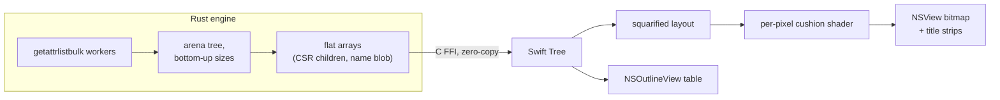

# BlitzTree

WizTree-class disk treemap for macOS. Scans a full disk (~2M files) in seconds, fully native UI.

> i got mad there was nothing as fast and as nice as wiztree for my macbook so i made this pretty quickly in like 1 hour with only claude fable 5. its pretty good


Cushion-shaded treemap (WinDirStat style) with directory title strips, a Finder-style outline table, live scan progress, and an optional free-space block. Rust scan engine, Swift/AppKit front end. No network, no telemetry.

## Why it's fast

- macOS has no NTFS MFT to read, but `getattrlistbulk(2)` returns a whole directory of metadata per syscall — no per-file `stat`.
- A rayon worker pool keeps many directories in flight at once, which is where APFS actually parallelizes.
- Scan threads pin to `QOS_CLASS_USER_INTERACTIVE`, so GUI scheduling never parks them on efficiency cores (that alone was a 2× win).
- `searchfs(2)` — the closest MFT analog — benchmarked **8× slower**: it's one sequential kernel catalog iteration and can't be parallelized. Measurements in [PLAN.md](PLAN.md).

## Architecture



While scanning, the UI polls atomic counters at 30 Hz for live progress. On completion the tree crosses the FFI once as flat arrays and Swift reads them in place — no serialization, no copies.

## Run

```sh
./build.sh                      # needs Xcode CLT + Rust
open build/BlitzTree.app
```

`./deploy.sh` installs to /Applications. `BlitzTree /some/path` scans a specific folder.

Requires Apple Silicon and macOS 26+. Grant Full Disk Access on first launch (the app gates scanning on it rather than spamming permission prompts), then relaunch.

## Notes

- Deletion only happens via right-click → Move to Trash, behind a confirmation.
- Root-only system areas (Spotlight index, unified logs) are unreadable without elevation; the status bar reports that gap instead of hiding it.

MIT
